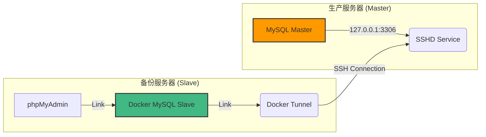

# Dockerized MySQL SSH Replication Kit
# 基于 Docker 和 SSH 隧道的 MySQL 多实例安全备份方案

[](https://www.docker.com/)
[](https://www.mysql.com/)
[](./LICENSE)

这是一个专为**高并发、多实例**环境设计的 MySQL 实时备份解决方案。它利用 **Docker 容器化隔离** 和 **SSH 隧道技术**，在不暴露生产数据库公网端口的前提下，实现安全、低侵入的实时主从复制（Master-Slave Replication）。

---

## 🌟 核心特性 (Features)

*   **🔒 极致安全**: 生产数据库无需开放 `3306` 端口到公网，所有流量经过 SSH 加密隧道传输。
*   **🚀 零侵入备份**: 备份操作（压缩、打包、IO写入）完全在备份服务器进行，生产服务器仅传输 Binlog，对业务性能影响极低。
*   **📦 容器化隔离**: 每一个备份实例都是独立的 Docker 容器，互不干扰。无论是 1 个还是 100 个项目，都能独立管理。
*   **👁️ 可视化管理**: 每个实例自带独立的 **phpMyAdmin**，随时查看备份数据状态。
*   **📉 资源限制**: 可通过 Docker 限制每个备份实例的 CPU 和内存占用，防止备份任务拖垮服务器。

---

## 🏗️ 架构原理 (Architecture)



**数据流向：**
1.  **Tunnel 容器** 通过 SSH 登录生产服务器，建立端口转发。
2.  **Backup 容器** 连接 Tunnel 容器的映射端口。
3.  **Production MySQL** 将数据通过加密隧道实时推送给 Backup 容器。

---

## 🛠️ 快速开始 (Quick Start)

### 第一阶段：生产环境配置 (Master)

在您的**生产服务器**上，需要进行一次性配置以开启复制功能。

1.  **修改 MySQL 配置** (`my.cnf` 或 `docker-compose` 挂载配置)：
    ```ini
    [mysqld]
    # 唯一ID (只要不和备份库的 100 冲突即可，通常设为 1)
    server-id = 1
    # 开启 Binlog
    log-bin = mysql-bin
    binlog_format = ROW
    # 开启 GTID (强烈推荐，实现自动断点续传)
    gtid_mode = ON
    enforce_gtid_consistency = ON
    ```

2.  **安全端口映射** (Docker Compose):
    *请确保生产库端口仅监听本地，不要暴露给公网！*
    ```yaml
    ports:
      - "127.0.0.1:3306:3306"  # ✅ 正确：仅允许本机(及SSH隧道)访问
      # - "0.0.0.0:3306:3306"  # ❌ 错误：极其危险
    ```

3.  **创建复制账号**:
    ```sql
    CREATE USER 'repl_user'@'%' IDENTIFIED BY 'your_secure_password';
    GRANT REPLICATION SLAVE ON *.* TO 'repl_user'@'%';
    FLUSH PRIVILEGES;
    ```

---

### 第二阶段：部署备份实例 (Slave)

在**备份服务器**上，只需复制模板并启动。

#### 1. 复制项目模板
```bash
cp -r template my_backup_project
cd my_backup_project
```

#### 2. 配置环境变量
复制或编辑 `.env` 文件，填入生产服务器信息。

```ini
# .env 示例

# === 基础配置 ===
PROJECT_NAME=shop_prod    # 项目名称
SSH_HOST=1.2.3.4          # 生产服务器 IP
SSH_USER=root             # 生产服务器 SSH 用户

# === 数据库连接 ===
REMOTE_DB_PORT=3306       # 生产服务器 MySQL 映射在宿主机的端口
MASTER_USER=repl_user     # 刚才创建的复制账号
MASTER_PASSWORD=xxxxxx

# === 本地端口规划 (避免冲突) ===
LOCAL_PORT=13306          # 本机访问备份库的端口
PMA_WEB_PORT=8888         # phpMyAdmin 访问端口
```

#### 3. 放入 SSH 私钥 (推荐)
将生产服务器的私钥 (`id_rsa`) 放入当前目录。
*(如果没有私钥，也可以在 .env 中配置 SSH_PASSWORD，但不推荐)*

#### 4. 一键启动
```bash
docker-compose up -d
```

---

## 📊 验证与管理

### 1. 访问数据库 (命令行)
进入容器检查同步状态：
```bash
docker exec -it backup_project_a mysql -u root -p
# 输入密码后执行:
SHOW SLAVE STATUS\G;
```

### 2. 访问 phpMyAdmin (🔐 安全隧道模式)
为了极致安全，phpMyAdmin **不在备份服务器对外开放**。管理员需通过 SSH 隧道在本地访问。

**在你的电脑上 (管理员 PC) 执行：**
```bash
# 格式: ssh -L [本地端口]:127.0.0.1:[备份服务器PMA端口] [备份服务器用户]@[备份服务器IP]
ssh -L 8888:127.0.0.1:8888 root@1.2.3.4
```

**然后在本地浏览器访问：**
*   http://localhost:8888

*(原理：你访问自己电脑的 8888，流量被 SSH 秘密传送到备份服务器内部的 8888，最终到达 phpMyAdmin 容器)*

---

## 🗂️ 进阶：手动导入导出 (大数据量首选)

如果数据库体积较大（>2GB），网络直接同步极其缓慢且不稳定。建议采用 **"Docker 导出 -> 传输 -> Docker 导入"** 的方式完成初始同步。

### 1. 生产端导出 (Export)
登录 **生产服务器**，执行以下命令导出数据快照：

```bash
# 导出并压缩 (请替换 [容器名], [密码], [库名])
# --master-data=2 能够自动记录当前的同步坐标，对主从至关重要
docker exec [生产容器名] mysqldump -u root -p[生产密码] \
  --single-transaction \
  --master-data=2 \
  --triggers --routines --events \
  --databases [需要备份的库名] \
  | gzip > initial_snapshot.sql.gz
```

### 2. 备份端导入 (Import)
将 `initial_snapshot.sql.gz` 传输到 **备份服务器** 项目根目录，然后执行：

```bash
# 流式解压并导入 (无需手动解压，节省空间)
# 1. 临时关闭同步 (防止写入冲突)
docker exec -i [备份容器名] mysql -u root -p[本地密码] -e "STOP SLAVE; SET GLOBAL sql_log_bin=0;"

# 2. 导入数据
zcat initial_snapshot.sql.gz | docker exec -i [备份容器名] mysql -u root -p[本地密码]

# 3. 恢复同步
# 数据导入包含坐标信息，START SLAVE 会自动从快照时刻继续同步
docker exec -i [备份容器名] mysql -u root -p[本地密码] -e "SET GLOBAL sql_log_bin=1; START SLAVE; SHOW SLAVE STATUS\G;"
```

---

## 🆘 灾难恢复 (Disaster Recovery)

当生产环境发生故障需要回滚数据时，利用本项目的架构优势，你可以直接通过安全隧道将备份数据“推”回生产库，无需手动拷贝文件。

### 🚀 极速管道恢复
无需落地文件，直接通过 Docker 内部网络和 SSH 隧道，将备份库的数据流式传输回生产库。

```bash
# ⚠️ 高危操作：这将覆盖生产库数据！请再次确认！
# 必须先确保生产库的对应数据库已清空或允许覆盖。

# 在备份服务器执行：
docker exec [备份容器名] bash -c "mysqldump -u root -p[本地密码] --databases [目标库名] \
  | mysql -h tunnel -P 3306 -u [生产用户] -p[生产密码]"
```

**原理说明：**
*   `mysqldump`：读取本地备份容器的数据。
*   `|` (管道)：将数据流直接传递给下一个命令。
*   `mysql -h tunnel`：连接到 `tunnel` 容器（即连接到了生产服务器）。
*   整个过程数据流不落地，速度取决于网络带宽，且全程经过 SSH 加密。

---

## ❓ 常见问题 (Q&A)

**Q: 生产数据量已经很大(如 100GB)，可以直接启动吗？**
A: **不可以**。初次同步建议先在生产端做一次全量导出 (`mysqldump`)，将 SQL 文件放入备份项目的 `data/` 目录中，让 Docker 在首次启动时自动导入，然后再开启同步。

**Q: 为什么提示连接不上生产库？**
A: 请检查：
1. 生产服务器是否安装了 `openssh-server`。
2. 生产 MySQL 的端口映射是否绑定了 `127.0.0.1`。
3. SSH 私钥权限是否正确。

**Q: 多个项目如何管理？**
A: 简单的复制 `template` 目录为不同名称（如 `backup_shop`, `backup_blog`），修改 `.env` 中的端口号（`LOCAL_PORT`, `PMA_WEB_PORT`），互不冲突。

---

## 📄 License

MIT License.
