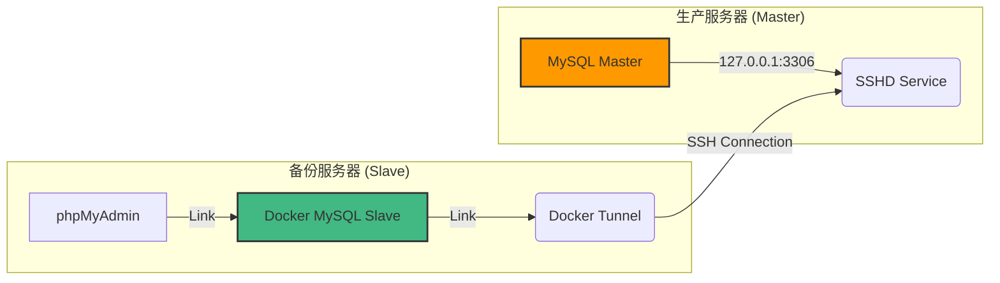

# Dockerized MySQL SSH Replication Kit
# 基于 Docker 和 SSH 隧道的 MySQL 多实例安全备份方案

[](https://www.docker.com/)
[](https://www.mysql.com/)
[](./LICENSE)

这是一个专为**高并发、多实例**环境设计的 MySQL 实时备份解决方案。它利用 **Docker 容器化隔离** 和 **SSH 隧道技术**，在不暴露生产数据库公网端口的前提下，实现安全、低侵入的实时主从复制（Master-Slave Replication）。

---

## 🌟 核心特性 (Features)

*   **🔒 极致安全**: 生产数据库无需开放 `3306` 端口到公网，所有流量经过 SSH 加密隧道传输。
*   **🚀 零侵入备份**: 备份操作（压缩、打包、IO写入）完全在备份服务器进行，生产服务器仅传输 Binlog，对业务性能影响极低。
*   **📦 容器化隔离**: 每一个备份实例都是独立的 Docker 容器，互不干扰。无论是 1 个还是 100 个项目，都能独立管理。
*   **👁️ 可视化管理**: 每个实例自带独立的 **phpMyAdmin**，随时查看备份数据状态。
*   **📉 资源限制**: 可通过 Docker 限制每个备份实例的 CPU 和内存占用，防止备份任务拖垮服务器。

---

## 🏗️ 架构原理 (Architecture)



---

## 🛠️ 部署指南 (Deployment Guide)

### 第一阶段：生产环境配置 (Master)

在您的**生产服务器**上，需要进行一次性配置以开启复制功能。

1.  **修改 MySQL 配置** (`my.cnf` 或 `docker-compose` 挂载配置)：
    ```ini
    [mysqld]
    server-id = 1             # 唯一ID
    log-bin = mysql-bin       # 开启 Binlog
    binlog_format = ROW
    gtid_mode = ON            # 开启 GTID (强烈推荐)
    enforce_gtid_consistency = ON
    ```

2.  **创建复制账号**:
    ```sql
    CREATE USER 'repl_user'@'%' IDENTIFIED BY 'your_secure_password';
    GRANT REPLICATION SLAVE ON *.* TO 'repl_user'@'%';
    FLUSH PRIVILEGES;
    ```

---


### 第二阶段：部署备份实例 (Slave)

在**备份服务器**上执行。

1.  **初始化项目**:
    ```bash
    cp -r template my_backup_project
    cd my_backup_project
    ```

2.  **配置环境变量 (`.env`)**:
    *   修改 `SSH_HOST`, `SSH_USER` 等连接信息。
    *   修改 `REMOTE_DB_PORT` (生产库端口) 和 `PMA_WEB_PORT` (本地管理端口)。

3.  **启动容器**:
    ```bash
    docker-compose up -d
    ```

---


### 第三阶段：选择同步方式 (Synchronization)

根据您的数据库数据量大小，选择一种同步方式：

#### ✅ 方式 A: 极速同步 (适用于新项目/空库)
如果主库是新建立的，或者您只希望从“当前时刻”开始备份后续数据，不需要历史数据。

1.  确保容器已启动 (`docker-compose up -d`)。
2.  直接运行一键脚本：
    ```bash
    ./quick_start_sync.sh
    ```
3.  脚本会自动连接生产库获取坐标，并启动本地同步。

#### ✅ 方式 B: 标准逻辑导入 (适用于 < 20GB 数据)
如果需要完整的历史数据，且数据量中等。

1.  **生产端导出** (Master):
    ```bash
    # 自动记录 master-data 坐标
    docker exec [生产容器] mysqldump -u root -p \
      --single-transaction --master-data=2 --databases [库名] \
      | gzip > snapshot.sql.gz
    ```
2.  **传输文件**: 将 `snapshot.sql.gz` 传到备份服务器项目目录。
3.  **备份端导入** (Slave):
    ```bash
    # 流式导入 (无需解压)
    zcat snapshot.sql.gz | docker exec -i [备份容器] mysql -u root -p[本地密码]
    ```

#### ✅ 方式 C: 物理热备恢复 (适用于 > 20GB 大数据)
如果数据量巨大，使用 mysqldump 会导致性能问题，推荐使用 XtraBackup。

1.  **生产端打包**:
    将 `backup_physical.sh` 上传至生产服务器并运行：
    ```bash
    # 生成 .tar.gz 物理备份包
    ./backup_physical.sh [生产容器名] [MySQL密码]
    ```
2.  **备份端恢复**:
    将压缩包传回备份服务器，运行恢复脚本：
    ```bash
    # 自动解压、Prepare数据、修正权限并打印同步坐标
    ./restore_slave.sh ./prod_full.tar.gz ./data
    ```
3.  **启动同步**:
    重启备份容器，使用脚本打印出的 `CHANGE MASTER TO...` 语句进入数据库执行。

---


## 📊 验证与管理

### 1. 命令行检查
```bash
docker exec -it backup_project mysql -u root -p -e "SHOW SLAVE STATUS\G"
```
*   `Slave_IO_Running`: Yes
*   `Slave_SQL_Running`: Yes

### 2. 可视化管理 (phpMyAdmin)
为了安全，phpMyAdmin 默认绑定在 `127.0.0.1`。
在管理员 PC 上建立 SSH 隧道访问：
```bash
ssh -L 8888:127.0.0.1:8888 root@备份服务器IP
```
浏览器访问: `http://localhost:8888`

---


## 🆘 灾难恢复 (Disaster Recovery)

当生产环境数据丢失，利用 SSH 隧道将备份数据“推”回生产库。

```bash
# ⚠️ 高危操作：将覆盖生产库指定数据库
docker exec [备份容器] bash -c "mysqldump -u root -p[本地密码] --databases [目标库] \
  | mysql -h tunnel -u [生产用户] -p[生产密码]"
```

---


## 📄 License

MIT License.

```
